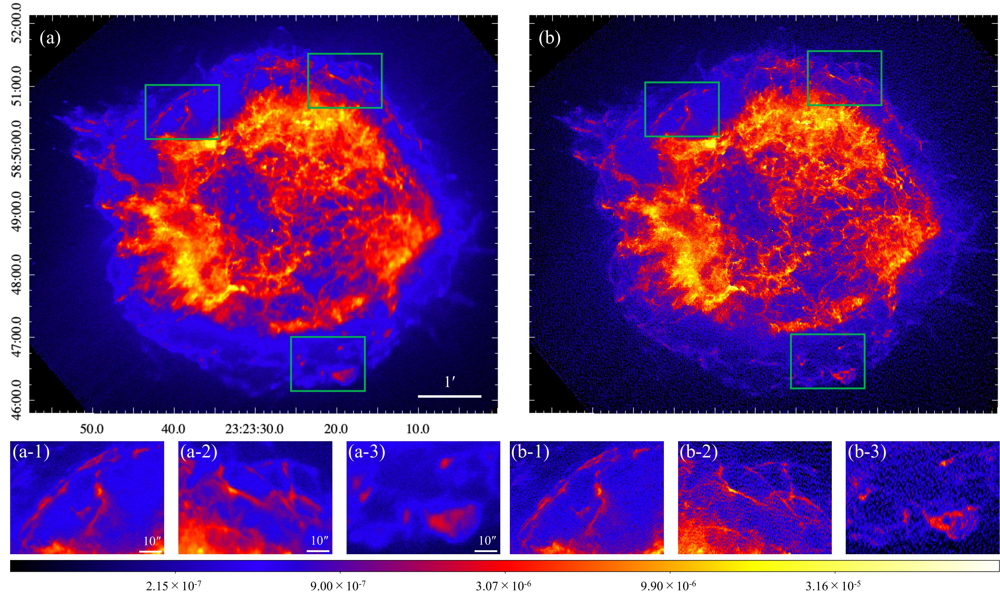
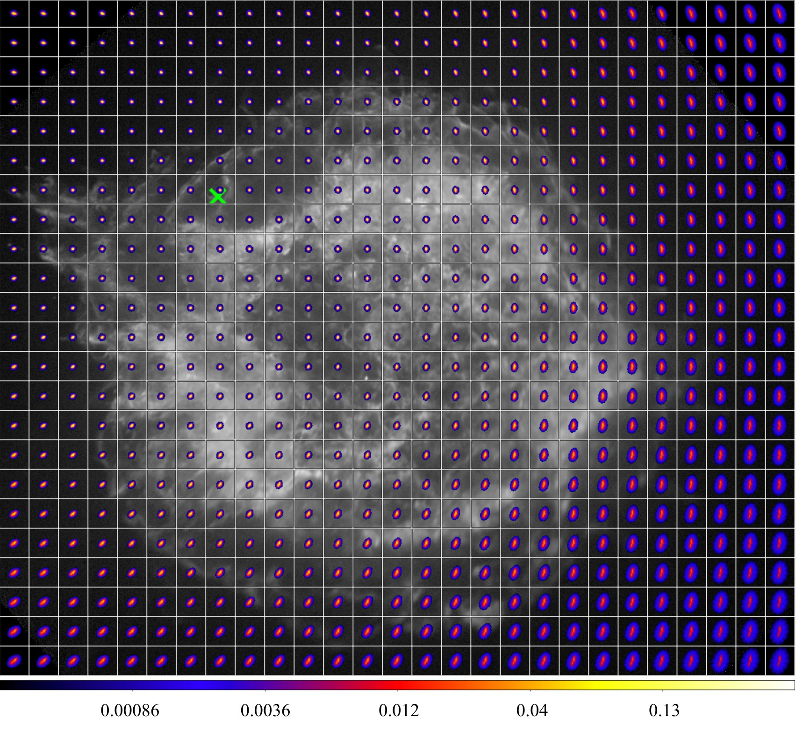

# PDRL: Position-Dependent Richardson-Lucy deconvolution
Code for this paper: [Richardson–Lucy Deconvolution with a Spatially Variant Point-spread Function of Chandra: Supernova Remnant Cassiopeia A as an Example](https://doi.org/10.3847/1538-4357/acd9b3)

Yusuke Sakai , Shinya Yamada , Toshiki Sato, Ryota Hayakawa, Ryota Higurashi , and Nao Kominato

Accepted in APJ (2023).

**Please note that the provided code is not a finished product, and we do not guarantee its functionality or suitability for any specific purpose. Use it at your own risk.**

## Overview
Position-Dependent Richardson-Lucy (PDRL) deconvolution is an extension of the Richardson-Lucy deconvolution method, specifically designed for images with multiple positional point spread functions (PSFs).

<br>
Figure 2. (a) X-ray image in the 0.5-7.0 keV band of Cas A obtained with Chandra. (a-1, -2, -3) Enlarged images specified by the colored frames in (a). (b) Same as (a), but for the RLsv-deconvolved results. The unit of flux in the images is $\rm{photons~cm^{-2}~s^{-1}}$.

The 35 x 35 pixel spacing of PSFs used in the above PDRL image.

Cas A image (Obs. ID = 4636) and the two-dimensional probabilities of the PSFs. The integral of each PSF is normalized to be 1. The PSF color scale is a fixed range. The location of the optical axis is indicated with a green cross.

## Our Environments
* DISTRIB_ID=Ubuntu
* DISTRIB_RELEASE=20.04
* DISTRIB_CODENAME=focal
* DISTRIB_DESCRIPTION="Ubuntu 20.04.3 LTS"
* Chandra CIAO-4.13
* marx-5.5.1
* python=3.8.2
* astropy==5.1
* numpy==1.22.4
* tqdm==4.64.0

## Description of Each File
Our code is optimized for Chandra X-ray observed images and utilizes [CIAO](https://cxc.cfa.harvard.edu/ciao/ahelp/merge_obs.html) and [MARX](https://space.mit.edu/ASC/MARX/) for PSF simulation.

### 0. Install MARX and build environment
Please refer to the CIAO [simulate_psf](https://cxc.cfa.harvard.edu/ciao/ahelp/simulate_psf.html) documentation for instructions on installing MARX and setting up the environment. (If you have not installed CIAO, please refer to the official CIAO documentation.)

### 1. Prepare count map and exposure map
Prepare the count map and exposure map files required for the PDRL method.

### 2. Obtain ra, dec coordinates for PSF simulation
Use the "pixel2skycoord.py" script to obtain the sky coordinates for each position and save them in a .txt file for use with CIAO simulate_psf.
```
python pixel2skycoord.py [-h] infile outfile psf_bins
```
infile: Input counts map file<br>
outfile: Output .txt file containing image_y, image_x, ra, dec<br>
psf_bins: Pixel spacing for creating PSF (Smaller values result in better accuracy but require more computation time)

### 3. Generate PSF from coordinates file created in Step 2
Use CIAO simulate_psf to generate the PSF for each position using the ra, dec .txt file. 

**It is recommended to run the code in the background (e.g., using the "screen" command) as simulating PSFs can take a significant amount of time.**
```
bash simulate_psf.sh [-h] infile_txt infile_fits monoenergy outdir
```
infile_txt: Input .txt file containing image_y, image_x, ra, dec<br>
infile_fits: Input event FITS file (Note: not a counts map file)<br>
monoenergy: Set the PSF monoenergy<br>
outdir: Output directory for each position's PSF

### 4. PSF adjustment
Move the center of the PSFs to the image center and adjust all PSFs to the same size.
```
repro_psfs.py [-h] infile psfs_dir outfile psfs_bins
```
infile: input counts map file for made psfs (Note: not evt file)<br>
psfs_dir: input raw psf dir for each location<br>
outfile: output all psf .npz file<br>
psfs_bins: spacing of pixels you made each position psf<br>

### 5. Run PDRL
This is PDRL method. Results for all iterations are saved.
```
python LDRL.py [-h] thresh_img expmap psfs outdir [--num_iter NUM_ITER] [--lambda_tv LAMBDA_TV]
               [--data_type DATA_TYPE] [--im_deconv_0_flat] [--poisson_err]
               [--boundary_px BOUNDARY_PX]
```

thresh_img: Input counts map file for PDRL<br>
expmap: Input exposure map file for PDRL<br>
psfs: Input PSF file for each infile position (.npz)<br>
outdir: Output directory for each iteration of PDRL results<br>
--num_iter NUM_ITER: Number of iterations for PDRL (default: 200)<br>
--lambda_tv LAMBDA_TV: TV (Total Variation) regularization lambda for PDRL (default: 0.002)<br>
--data_type DATA_TYPE: Numpy data type (default: float64). If "killed" is returned, using float32 can help reduce memory usage.<br>
--im_deconv_0_flat: Initial value for the 0th iteration of the LDRL method (default: False, meaning the input file)<br>
--poisson_err: Add a Poisson distribution random number according to the input count file for each iteration (default: False)<br>
--boundary_px BOUNDARY_PX: Randomly select a PSF from boundary_px pixels near the boundary of the PSFs (default: 1)

### 6. Run PDRL error analysis
Calculate the uncertainty of the PDRL method using error propagation.
```
python PDRL_err.py [-h] thresh_img expmap psfs im_deconv outfile [--data_type DATA_TYPE]
```

thresh_img: Input counts map file for PDRL
expmap: Input exposure map file for PDRL
psfs: Input PSF file for each infile position (.npz)
im_deconv: Input PDRL result to calculate the next iteration's PDRL uncertainty
outfile: Output file for PDRL error result
--data_type DATA_TYPE: Default: float64. Numpy data type. (Note: If `killed` is returned, using float32 can be useful to reduce memory usage)

## Demonstration
The demonstration code provides the results mentioned above. After completing step 0, run the following code:
```
bash demo.sh
```

## Quick Demonstration
Place the following files directly in the demo directory:
* [merged_4636_4637_4639_5319](https://drive.google.com/file/d/1jNSmAmFOXCZtuikxnf2gb5QXl2mmt0Gg/view?usp=share_link)(merged Obs. ID=4636, 4637, 4639, and 5319 counts map and exposure map files)
* [repro_psfs_35bin.npz](https://drive.google.com/file/d/1qa6gsLghqQbbsElNKirOgW-UdVKlTzIv/view?usp=share_link)(35 × 35 pixels Obs. ID 4636 PSFs)

Then, in the demo directory, run the PDRL method with the following command:
```
python ../pyscript/PDRL.py merged_4636_4637_4639_5319/broad_thresh.img merged_4636_4637_4639_5319/broad_thresh.expmap \
       repro_psfs_35bin.npz PDRL_results --lambda_tv 0 --boundary_px 0
```

After completion, to obtain the uncertainty of the 200th iteration based on the 199th iteration of the PDRL method, use the following command:

```
python ../pyscript/PDRL_err.py merged_4636_4637_4639_5319/broad_thresh.img merged_4636_4637_4639_5319/broad_thresh.expmap \
       repro_psfs_35bin.npz PDRL_results/iter_0199.fits iter_0200_err.fits
```

## Citing
If you find our code helpful, we would appreciate it if you could cite the following reference as a token of acknowledgment:
```
@article{Sakai_2023,
doi = {10.3847/1538-4357/acd9b3},
url = {https://dx.doi.org/10.3847/1538-4357/acd9b3},
year = {2023},
month = {jul},
publisher = {The American Astronomical Society},
volume = {951},
number = {1},
pages = {59},
author = {Yusuke Sakai and Shinya Yamada and Toshiki Sato and Ryota Hayakawa and Ryota Higurashi and Nao Kominato},
title = {Richardson–Lucy Deconvolution with a Spatially Variant Point-spread Function of Chandra: Supernova Remnant Cassiopeia A as an Example},
journal = {The Astrophysical Journal},
}
```

